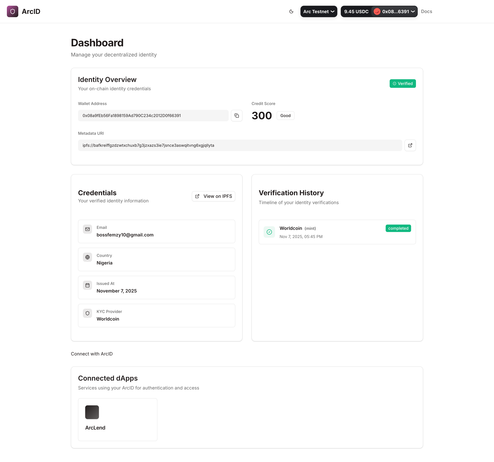
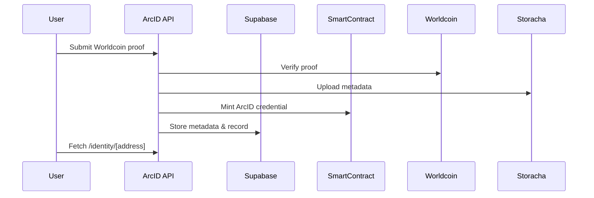

# ArcID — Decentralized Identity Framework for Arc Network

**ArcID** is an on-chain identity system built to verify, issue, and manage decentralized credentials — powered by Worldcoin, Supabase, and the Arc Network.

It provides APIs for minting, verifying, and updating identity credentials tied to wallet addresses, along with smart contracts deployed to Arc Testnet.



---

## Overview

ArcID bridges **Web2 user verification** (via Worldcoin) with **Web3 identity issuance**.  
It enables developers to integrate verified, privacy-preserving digital identities into their dApps and services.

### Key Features

- **Worldcoin-verified identity issuance**
- **On-chain minting** of verifiable ArcID credentials
- **Identity updates and revocations**
- **Credit score derivation** logic for user trust metrics
- **Supabase-backed identity storage**
- **Next.js + TypeScript API endpoints**
- **Smart contracts deployed via Foundry (Forge)**

---

## Tech Stack

| Layer              | Stack                                     |
| ------------------ | ----------------------------------------- |
| **Frontend / API** | Next.js 15, TypeScript                    |
| **Blockchain**     | Solidity, Foundry (Forge)                 |
| **Database**       | Supabase                                  |
| **Storage**        | Storacha (for metadata IPFS upload)       |
| **Verification**   | Worldcoin                                 |
| **Deployment**     | Vercel (frontend), Arc Testnet (contract) |

---

## Setup

### 1. Clone the repo

```bash
git clone https://github.com/<your-org>/arcid.git
cd arcid
```

### 2. Install dependencies

```bash
npm install
```

### 3. Set environment variables

Create a `.env.local` file in the root:

```bash
# RPC + Keys
RPC_URL=https://rpc.testnet.arc.network
VERIFIER_PRIVATE_KEY=0xabc123...
ARCID_CONTRACT_ADDRESS=0xYourDeployedContractAddress

# Worldcoin
WORLDCOIN_APP_ID=app_123...
WORLDCOIN_ACTION_ID=verify_identity

# Supabase
NEXT_PUBLIC_SUPABASE_URL=https://yourproject.supabase.co
NEXT_PUBLIC_SUPABASE_ANON_KEY=your_anon_key
SUPABASE_SERVICE_ROLE_KEY=your_service_role

# API
API_KEY=your_internal_api_key
```

---

## Smart Contract Deployment

Contracts live in `/contracts` and are managed using **Foundry**.

### Deploy to Arc Testnet

```bash
forge script script/DeployArcID.s.sol:DeployArcID \
  --rpc-url https://rpc.testnet.arc.network \
  --private-key $PRIVATE_KEY \
  --broadcast \
  --skip-simulation \
  -vvvv
```

After deployment, copy your deployed contract address into `.env.local`
as `ARCID_CONTRACT_ADDRESS`.

---

## API Routes

| Route                                  | Method | Description                                        |
| -------------------------------------- | ------ | -------------------------------------------------- |
| `/api/arcid/mint`                      | `POST` | Mint a new ArcID credential (Worldcoin verified)   |
| `/api/arcid/identity/[address]`        | `GET`  | Fetch user’s on-chain + Supabase identity metadata |
| `/api/arcid/update`                    | `POST` | Update existing ArcID credential                   |
| `/api/arcid/revoke`                    | `POST` | Revoke identity                                    |
| `/api/arcid/verify-identity`           | `POST` | Verify proof and issue Worldcoin verification      |
| `/api/worldcoin/verify`                | `POST` | Verify Worldcoin proof                             |
| `/api/arcid/connected-dapps/[address]` | `GET`  | List dApps the user connected with                 |
| `/api/arcid/history/[address]`         | `GET`  | Get verification or update history                 |

---

## Developer Notes

- The `ArcIDService` handles all blockchain interactions.
- Metadata is uploaded via `uploadMetadataToStoracha`.
- Supabase stores off-chain verifiable identity metadata.
- Contracts are modular and upgradable for multi-verifier support.

---

## Local Testing

You can test locally with **Anvil**:

```bash
anvil
```

Then run your API locally:

```bash
npm run dev
```

Mint a test identity:

```bash
curl -X POST http://localhost:3000/api/arcid/mint \
  -H "Content-Type: application/json" \
  -H "x-api-key: $API_KEY" \
  -d '{
    "userAddress": "0xYourTestWallet",
    "userData": { "country": "NG", "email": "user@example.com" },
    "proof": { "nullifier_hash": "0x123..." }
  }'
```

---

## Deployment

Frontend and APIs are deployed via **Vercel**.

Ensure you’ve added all environment variables under
**Project → Settings → Environment Variables**.

Then deploy:

```bash
vercel --prod
```

---

## License

MIT © 2025 Arc Network
Maintained by [@Femtech-web](https://github.com/Femtech-web)

---

## 🤝 Contributing

1. Fork the repo
2. Create a new branch (`feat/my-feature`)
3. Commit changes
4. Submit a PR 🚀

---

## Example Workflow



---

### Credits

Built with ❤️ using:

- Foundry
- Next.js
- Supabase
- Storacha
- Worldcoin
- Arc Network Testnet

---
